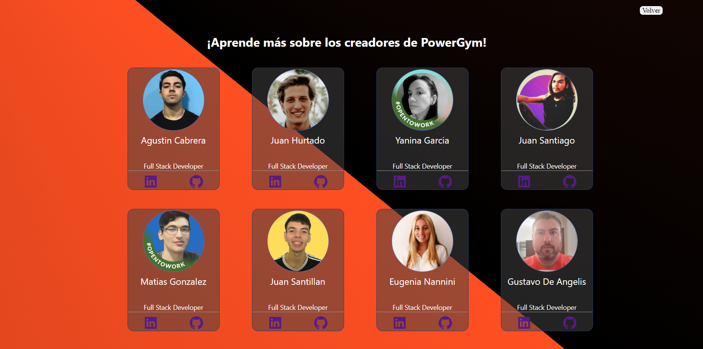
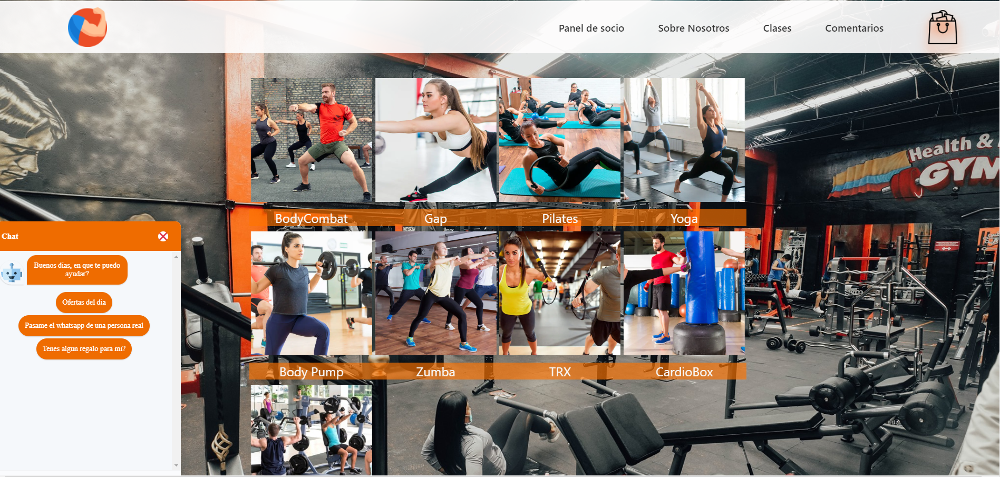
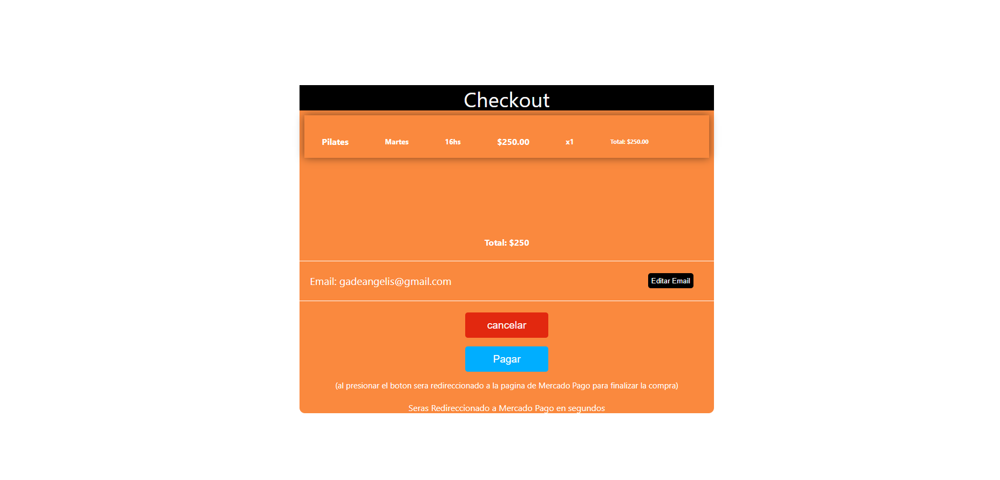
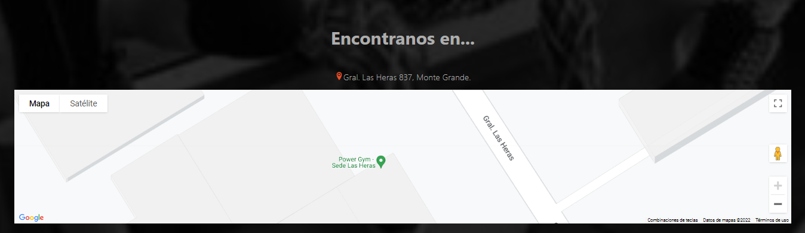
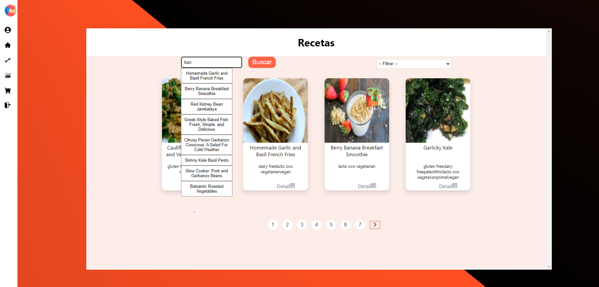

&nbsp;

<h2 align="center"> Power Gym App </h2>
<h4> En este proyecto el objetivo es darle una solución a un gimnasio, la cual le permita gestionar las distintas actividades brindadas por el mismo, generar alta de usuarios y asociarse a las clases disponibles, cobro de cuotas y membresías, sumado a esto brindar además un servicio extra donde se le brinde información al usuario sobre dietas alimenticias específicas para cada caso, algunas funcionalidades son: </h4>

<ul>
<li>Login en la cual el usuario podrá iniciar sesión o registrarse.</li>
<li>Dos roles en la app, administrador y usuario.</li>
<li>Footer con el contacto y las redes sociales del gimnasio. </li>
<li>Nav Bar con las diferentes secciones de la página. </li>
<li>Sección de carrito. </li>
<li>
Sección de dietas alimenticias. </li>
<li>
Sección de actividades del gimnasio con sus respectivos cupos, horarios y capacidad. </li>
<li> Pasarela de pago integrada con Mercado Pago para gestionar los cobros de las clases.</li>
<li>
Sección en donde se incluye la localización de la sucursal del gym seleccionada a través de la API de Google Maps. </li>
<li>Sección de dietas basada en API externa de comida en donde el usuario puede obtener recetas en base a sus necesidades.</li>
<li>Sección de perfil donde se puede visualizar las órdenes del usuario, dejar reviews de las clases adquiridas</li>
</ul>

  
  

  
  

  
  

  
  

  
  

&nbsp;

## Contributors

